# MCX_Vision_Library

## 一、介绍

逐飞科技基于NXP MCXN947为核心制作的图像处理模块，MCXN947自带NPU单元可以极大提升神经网络相关的计算速度。本开源项目分享了基于MCXN947的部分基础外设例程、以及目标检测从训练到部署的全过程。

## 二、环境准备

1. **MCX Vision模块**

- 使用本公司开发的MCX Vision模块，购买链接：[点击此处购买](https://item.taobao.com/item.htm?id=786816982538)。

2. **软件环境**

- 安装Keil MDK 5.38a 以及对应的 PACK包

- 如果需要使用目标检测功能还需要安装eIQ，Python软件

3. **仿真器**

- DAP仿真器：推荐使用本公司DAP仿真器，双下载模式，可以在支持的环境下实现更高下载速度。[点击此处购买](https://item.taobao.com/item.htm?id=583404964920)。

## 三、例程使用说明

1. **下载开源库：** 点击页面右侧的克隆/下载按钮，将工程文件保存到本地。您可以使用git克隆（Clone）或下载ZIP压缩包的方式来下载。推荐使用git将工程目录克隆到本地，这样可以使用git随时与我们的开源库保持同步。关于码云与git的使用教程可以参考以下链接 [https://gitee.com/help](https://gitee.com/help)。
2. **打开工程：** 将下载好的工程文件夹打开（若下载的为ZIP文件，请先解压压缩包）。在打开工程前，请务必确保您的IDE满足环境准备章节的要求。否则可能出现打开工程时报错，提示丢失目录信息等问题。

3. **连接下载器：**使用DAP下载器连接MCX Vision，并将下载器连接电脑
4. **下载代码：**使用Keil下载程序，下载完成后进行手动复位，程序开始执行

#### MCX Vision模块


## 四、 模块整体说明

MCXVision模块外观如下：

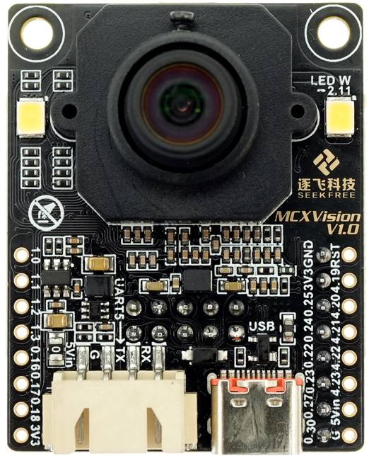

### 4.1、模块主控MCU芯片介绍

如模块名称所示，模块采用NXP的MCX系列MCU芯片，该芯片基于ARM Cortex-M33内核，主频为150MHz，内置512KB的RAM和2MB的Flash存储。尽管主频看似不高，但MCX芯片的SmartDMA外设可以在不占用CPU资源的情况下独立完成摄像头数据的采集，显著提升了数据获取的效率。此外，芯片还集成了NPU（神经网络处理单元），能够高效运行TensorFlow Lite（tflite）模型，进一步增强了模块的AI处理能力。这种设计巧妙地弥补了主频的不足，确保了模块在执行复杂视觉任务时依然能够保持高性能的主线任务。能极大地弥补主频较低的短板。

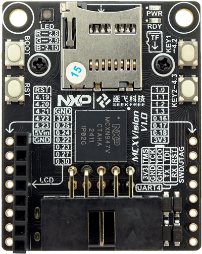

### 4.2、摄像头模组介绍

MCXVision模块配备了与凌瞳摄像头模组一致的高品质CMOS传感器，该传感器内置了ISP（图像信号处理器）单元，能够直接输出RGB565格式的全彩图像。凌瞳CMOS的高感光性能确保了在标准模式下能够提供精确的色彩，并且通过调整参数，可以切换到鲜艳模式，增强色彩饱和度，从而更易于进行颜色识别和特征检测。

此外，凌瞳CMOS在低光照条件下的表现同样出色，即便在缺乏补光的昏暗环境中，也能捕捉到清晰且细节丰富的图像，噪点控制效果在同类产品中属于领先水平。确保MCXVision模块在多种光照条件下都能提供高质量的视觉数据。

### 4.3、接口介绍

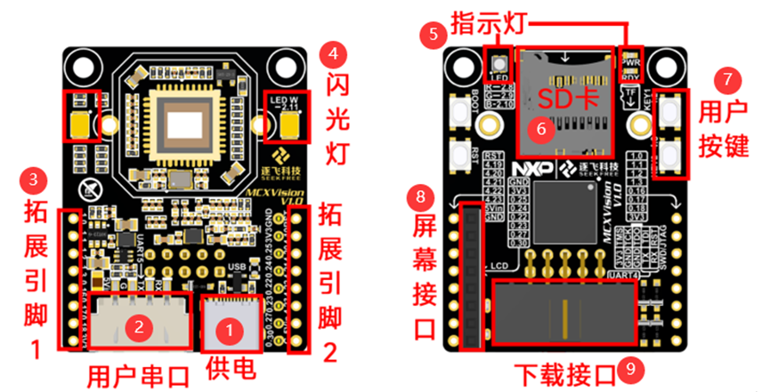

**1、供电接口：**使用TypeC接口输入5V。

**2、XH2.54-4P用户串口接口（串口5）：**可以使用这个接口输入5V进行供电，此接口的串口连接其他单片机或者使用TTL连接电脑可进行串口通信。

**3、拓展引脚：**根据需要使用这些引脚作为拓展使用。   

**4、闪光灯：**通过程序控制，用于前置补光。

**5、指示灯：**左侧的三色LED通过程序控制，可以作为状态显示。右侧的PWR为电源指示灯，上电会常亮。RDY为内核指示灯，程序正常运行会常亮。上电后没有亮说明内核没有启动，需要重新上电。如果RDY指示灯闪烁，说明程序进入错误报警。

**6、用户按键：**通过程序控制，用于人机交互。

**7、SD卡：**插入SD卡，通过程序实现文件管理。

**8、屏幕接口：**通过此接口连接IPS 2寸SPI屏幕

**9、SWD下载接口：**连接DAP下载器下载程序，这个接口带DEBUG串口（串口4），方便使用下载器进行串口通信调试。

## 五、开源资料说明

Gitee开源资料链接：https://gitee.com/seekfree/MCX_Vision_Library

下载资料压缩包，解压后可以看到如下文件：

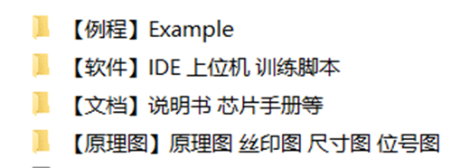

1、**【例程】Example**：包含MCXVision各个外设和目标检测的使用例程。

2、**【软件】IDE 上位机 训练脚本**：包含所需的软件、上位机、目标检测训练脚本。其中用到的部分软件体积过大，所以使用百度网盘存放，百度网盘链接如下：

**链接：https://pan.baidu.com/s/1oPnGLCXUUIqJ9OL2jw1Y8g**

**提取码：5k7w**   

3、**【文档】说明书 芯片手册等**：包含模块的使用说明书和MCX使用的芯片手册。

4、**【原理图】原理图 丝印图 尺寸图 位号图**：包含MCXVision的尺寸和图片。

## 六、与OpenART mini对比

OpenART mini模块通过使用MicroPython编程语言，利用Python语言的便捷性，能快速完成图像处理相关的任务，其固件内置的图像处理接口能够高效地执行多种图像处理功能。但是，这种便捷性也伴随着一些局限性，比如MicroPython需要先将程序解析成可以执行的代码，导致程序运行效率会有所下降。

MCXVision模块则在一定方面上弥补了这些不足。它采用C/C++作为编程语言，虽然学习难度相对较高，但提供了更高的灵活性和控制力，允许用户自行优化和调整算法，以适应不同的应用需求。MCXVision模块可以作为一个独立的图像处理单元，执行如赛道追踪、边缘检测、色块识别等复杂算法，等于一个图像协处理器，可以减轻主控芯片的负担，提升整体系统的性能，很适合用在今年的图片目标发现这一场景。

OpenART更适合用在分类和识别上，两者因为特点不同从而有不同的适用场景，同学们根据需求来选择使用的模块即可。为了帮助用户更快地掌握MCXVision模块的使用，我们将提供一系列的外设使用示例和应用示例，这些资源将有助于降低入门难度，加快开发进程。

作为NXP本届赛题的新MCU图像处理平台，大家最关心的应该还是运行模型的帧率如何，我们也进行了运行目标检测模型寻找目标板的对比测试：

1、OpenART mini运行的帧率如下（QVGA在5帧左右，QQVGA在8帧左右）：   


2、MCXVision运行模型的帧率如下（QVGA在20帧左右，QQVGA在30帧左右）：


并且，MCX上运行的模型输入大小为160*128，避免了之前在OpenART mini模型只能正方形的图像输入问题。

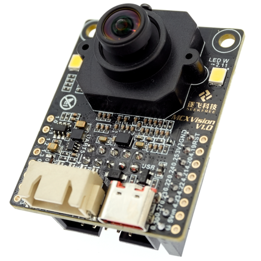

## 七、NPU与模型运行

MCX芯片集成eIQ Neutron神经处理单元，支持CNN、RNN、TCN、Transformer和大多数神经网络类型，能极大的提高模型的运算速度。既然如此我们来看看如何生成NPU专用的模型。详细说明在MCXVision说明书的模型训练章节。

1、安装python3.10.7版本，eIQ1.10.0版本（资料中提供）

2、拍摄目标检测图片，推荐使用OpenART mini进行拍摄，用上一届工具标记好的图片可以直接使用。

3、使用label_img工具标记图片（资料中提供）。

4、在资料中找到模型训练文件夹“Object_detection_training”，将文件夹移动到全英文路径，避免后续运行脚本报错。进入训练脚本文件夹“yolo_nano”。

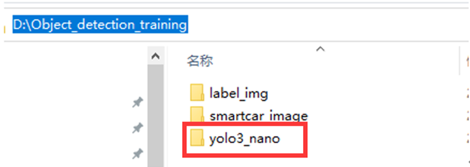

5、按住shift，鼠标右键点击文件夹空白位置,选择打开。Powershell窗口。

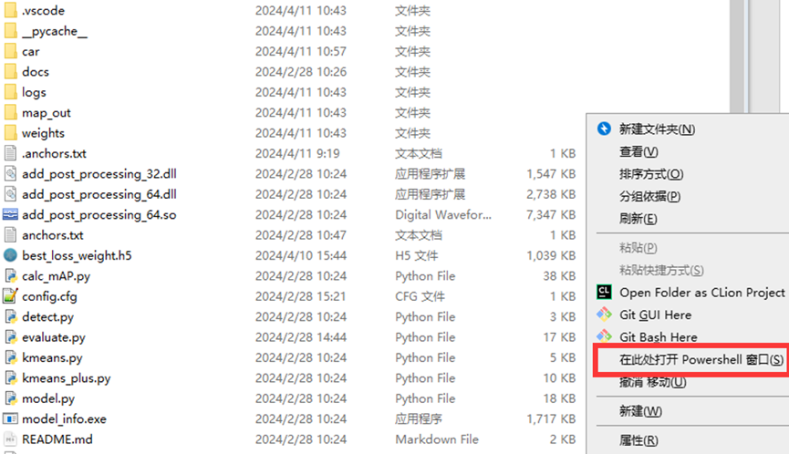

6、在Powershell窗口中依次运行如下的脚本。

```python
#安装库文件
pip install -r .\requirements.txt -i https://pypi.tuna.tsinghua.edu.cn/simple
#转换数据集
python .\voc_convertor.py
#生成预瞄框
python .\kmeans.py
#训练模型
python .\train.py
#验证模型
python .\evaluate.py
```

7、训练完成得到如下模型文件


8、打开eIQ软件，选择model tool。

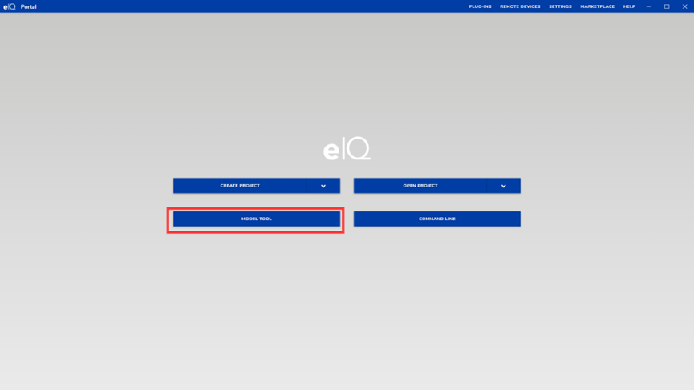

9、打开刚刚生成的模型

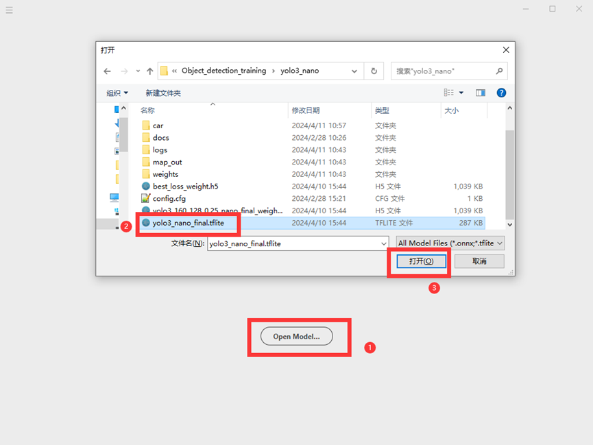

10、点击左上角的三根杠，然后点击Convert，转换成NPU使用的模型。

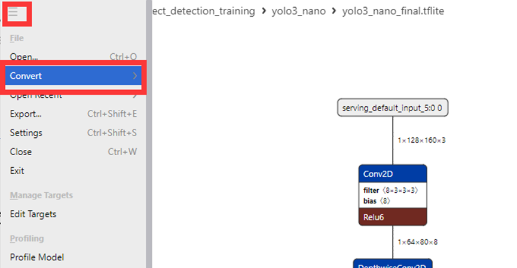

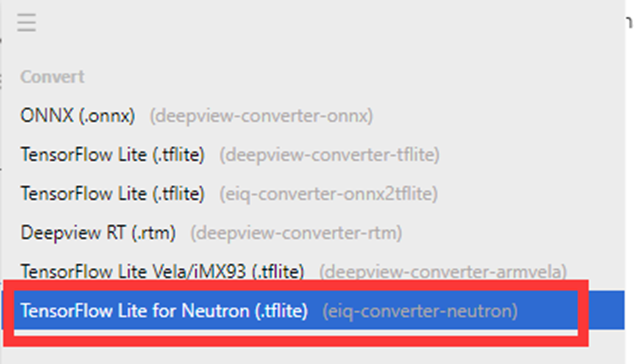

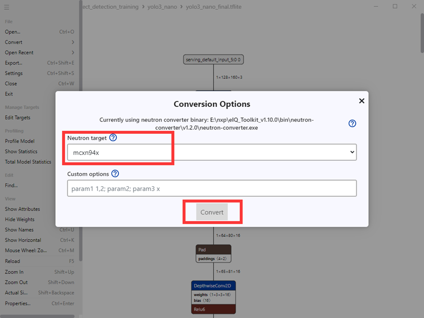

11、更改导出文件名称为smartcar_used19.tflite，导出到合适的位置，改名是为了后面方便使用。

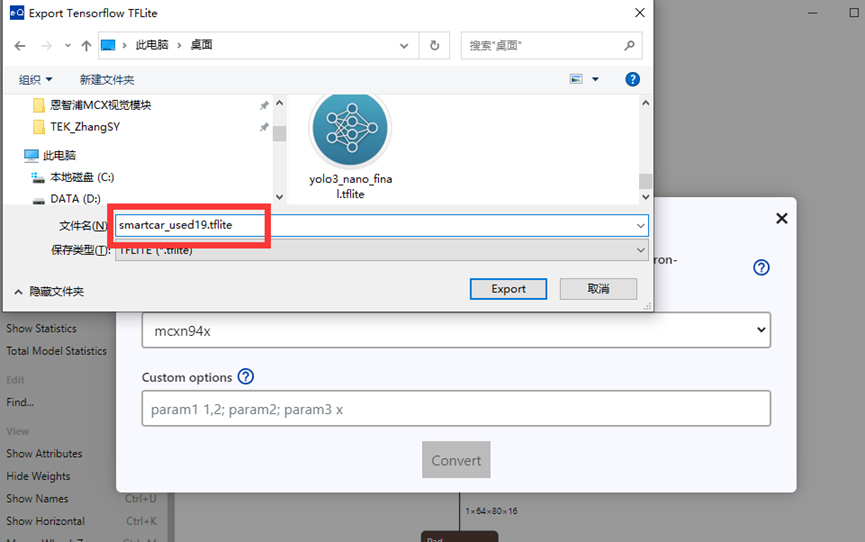

12、下载MCX资料，在资料中打开目标检测的例程。

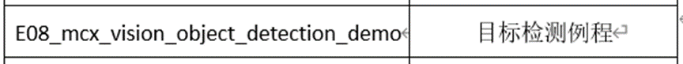

13、把模型放到user中，如果已存在就覆盖它，确保名称和这个名称完全相同。

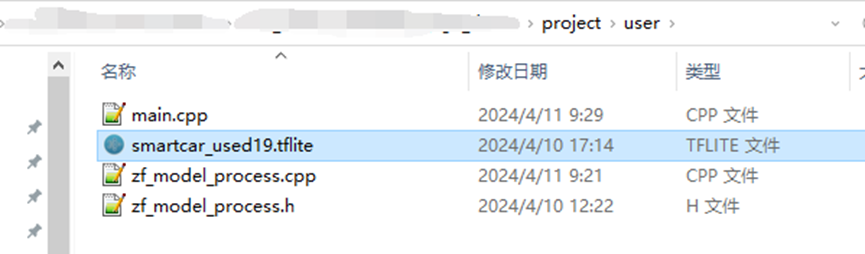

14、打开之前的训练脚本路径，打开里面的c_anchors.txt文件。

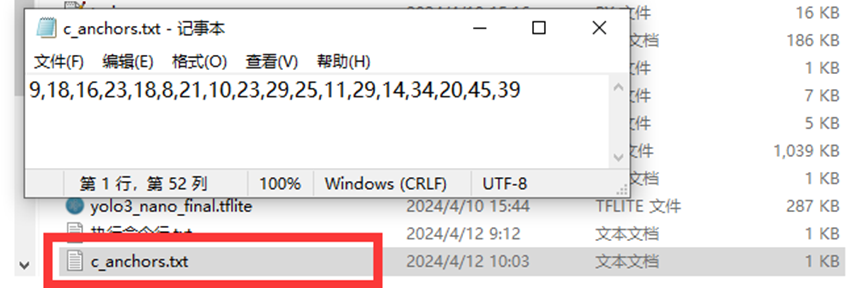

15、打开MCXVision的工程，也打开anchors.txt文件，并将刚刚复制的内容粘贴进去。

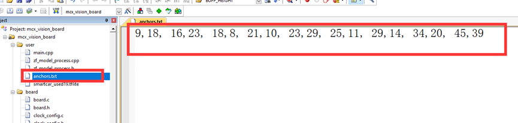

16、然后编译并下载程序即可运行训练好的模型，下载完程序后需要手动复位。

## 结束语

最后祝所有小伙伴都能在第十九届视觉组的比赛中取得满意成绩。也欢迎通过QQ群与车友们进行交流讨论（视觉组交流群①：946236488，视觉组交流群②：706938568）。也欢迎各位持续关注“逐飞科技”微信公众号，逐飞的开源项目、技术分享及智能车竞赛的相关信息更新都会在该公众号上发布，识别下方二维码即可关注。


